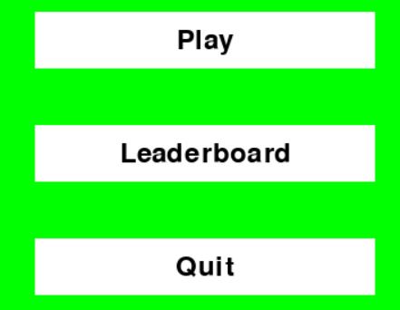
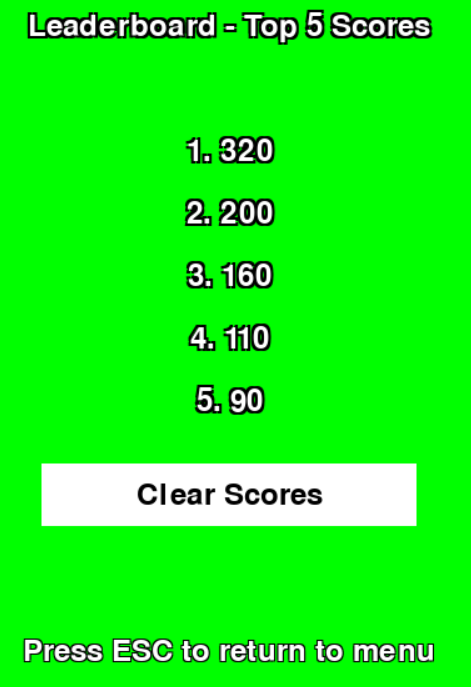
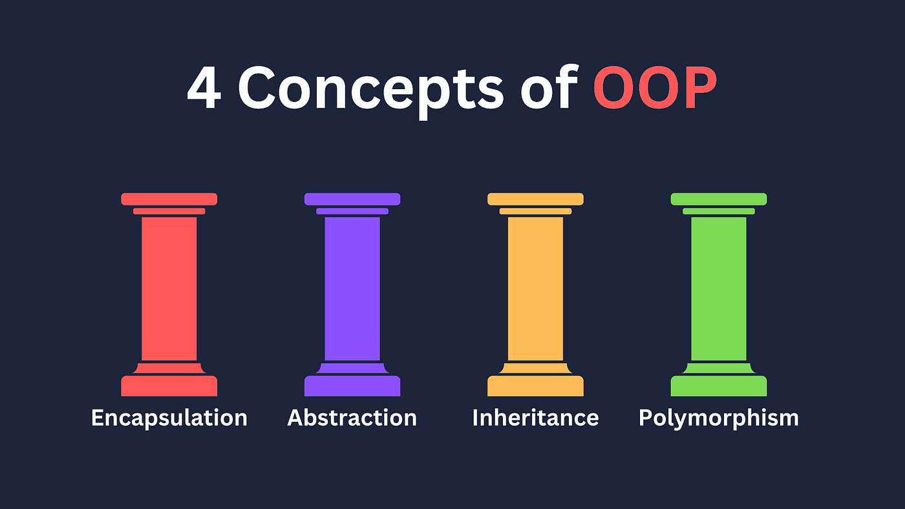
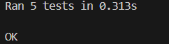

# Snake Game Course Work 
## made by Shyngys Zhaksylyk group EIRFU-23

## Overview
This Python project is an implementation of the classic Snake game using the `pygame` library. It features gameplay mechanics such as snake movement, food collection, score tracking, and a leaderboard system. The game showcases several Object-Oriented Programming principles and design patterns to provide a well-structured and extensible codebase.

## Installation
To run this game, you'll need Python and pygame installed on your machine.
- Python: Install from [python.org](https://www.python.org/downloads/)
- Pygame: Install using pip:
  ```bash
  pip install pygame

## How to start playing?
**To start a game:**
- Use hotkey: Ctrl + F5
- Press button "Run Python File" in VS Code.

**How to play?**

 
- Press button **"Play"** in the main menu
- Use __WASD__ or __Arrows__ to move snake
- Eat food to increase your score and length.

Food has two types: 
1. Red food gives you 10 points
2. Blue food gives you 20 points

## What about Leaderboard?
**While playing the game you can keep track of your best 5 attempts. You can view the list by clicking on the Leadboard button.**


**In the Leaderboard menu, you can see your yop 5 attempts. Also you can clear all your scores by pressing button "Clear Scores"**



# OOP pillars that are implemented in code:



## Polymorphism:
Polymorphism in OOP allows objects to be treated as instances of their parent class, with the ability to override or implement behaviors in different ways. In the code, polymorphism is evident in the way different game objects handle the draw() method:

- GameObject class declares an abstract method draw(). This method is then implemented distinctly in Snake and Food classes, each overriding the method to handle drawing specific to their type. Here, the same function name draw() is used for different object types, each behaving differently depending on the class that implements it.
``` ruby
class Snake(GameObject):
   def draw(self):
        [pg.draw.rect(self.game.screen, 'green', segment) for segment in self.segments]

class Food(GameObject):
    def draw(self):
        if self.food_type == 'normal':
            pg.draw.rect(self.game.screen, red, self.rect)
        elif self.food_type == 'bonus':
            pg.draw.rect(self.game.screen, blue, self.rect)
```

## Abstraction:
Abstraction involves hiding complex implementation details and showing only the essential features of the object.

- The GameObject class serves as an abstract base class for other game objects. It includes the abstract method draw(), which forces all subclasses to provide their own specific implementation of this method. The GameObject class provides a template and essential interfaces, hiding the details and complexity from the user (or developer in this case).
```ruby
class GameObject(ABC):
   @abstractmethod
    def draw(self):
        pass

```
## Inheritance:
Inheritance allows one class to inherit attributes and methods from another. This helps in code reusability and can enhance the application’s architecture:
- The Snake and Food classes inherit from the GameObject class. They use properties and methods defined in the GameObject class.
```ruby
class GameObject(ABC):
class Snake(GameObject):
class Food(GameObject):
```

## Encapsulation:
Encapsulation is about bundling the data (attributes) and methods that operate on the data into a single unit or class. It also restricts direct access to some of an object’s components, which can prevent the accidental modification of data:
- In the classes, data like rect, direction, size, segments, and methods that modify these data (move(), control(), check_food(), etc.) are encapsulated within the respective class. For instance, the Snake class encapsulates the details about snake segments, movement direction, and scoring, exposing only necessary methods to manipulate these details in a controlled way.
``` ruby
class Food(GameObject):
    def __init__(self, game, food_type='normal'):
    
class Score:
    def __init__(self, game):
```
- Additionally, attributes like _instances in the Singleton class are hidden from outside access, providing control over how instances of the class are created and accessed.
``` ruby
class Singleton(type):
    _instances = {}
    def __call__(cls, *args, **kwargs):
```
#  Design patterns that are implemented in code:

## Singleton Pattern:
The Singleton pattern ensures that a class has only one instance and provides a global point of access to it. This pattern is implemented in the Leaderboard class:
``` ruby
class Leaderboard(metaclass=Singleton):
    def __init__(self):
        self.file_path = "scores.txt"
        self.scores = self.load_scores()
```
## Factory Method Pattern:
Although not explicitly defined as a factory, your implementation hints at the Factory Method pattern through the way different types of Food objects are created based on the game conditions:
``` ruby
def react(self, snake):
    if self.food_type == 'normal':
        snake.length += 1
        snake.game.score.add_score(10)
    elif self.food_type == 'bonus':
        snake.length += 2
        snake.game.score.add_score(20)
```
## Command Pattern:
The Command pattern encapsulates a request as an object, thereby allowing for parameterization of clients with different requests, queue or log requests, and support undoable operations. While not fully implemented, the input handling in your game hints at this pattern:
```ruby
def control(self, event):
        if event.type == pg.KEYDOWN:
            if (event.key == pg.K_w or event.key == pg.K_UP) and self.directions[pg.K_w] and self.directions[pg.K_UP]:
                self.direction = vec2(0, -self.size)
                self.directions = {key: (key in [pg.K_w, pg.K_a, pg.K_d, pg.K_UP, pg.K_LEFT, pg.K_RIGHT]) for key in self.directions}

            if (event.key == pg.K_s or event.key == pg.K_DOWN) and self.directions[pg.K_s] and self.directions[pg.K_DOWN]:
                self.direction = vec2(0, self.size)
                self.directions = {key: (key in [pg.K_s, pg.K_a, pg.K_d, pg.K_DOWN, pg.K_LEFT, pg.K_RIGHT]) for key in self.directions}

            if (event.key == pg.K_a or event.key == pg.K_LEFT) and self.directions[pg.K_a] and self.directions[pg.K_LEFT]:
                self.direction = vec2(-self.size, 0)
                self.directions = {key: (key in [pg.K_w, pg.K_s, pg.K_a, pg.K_LEFT, pg.K_UP, pg.K_DOWN]) for key in self.directions}

            if (event.key == pg.K_d or event.key == pg.K_RIGHT) and self.directions[pg.K_d] and self.directions[pg.K_RIGHT]:
                self.direction = vec2(self.size, 0)
                self.directions = {key: (key in [pg.K_w, pg.K_s, pg.K_d, pg.K_RIGHT, pg.K_UP, pg.K_DOWN]) for key in self.directions}
```

## Unittest:
The unittest module is a built-in testing framework in Python, available as part of the standard library. 

The primary goal of the unittest module is to facilitate the creation of test cases and test suites to verify the behavior and correctness of individual units of code



## Summary:

In this coursework, I focused on reinforcing and applying Object-Oriented Programming (OOP) principles along with various design patterns in a practical setting using the Pygame library. The project involved developing a game or a simulation, which provided a hands-on opportunity to integrate theoretical OOP concepts into a real-world application.

Project Overview:
The project was structured around building a functional game from scratch. Pygame, a set of Python modules designed for writing video games, served as the foundation. The choice of Pygame was instrumental because it allowed for the application of OOP principles in managing graphical and event-driven interfaces that are common in game development.

This coursework not only solidified my foundational knowledge in OOP and design patterns but also provided a robust framework for future projects involving complex system design and interactive software development in Python. The experience has been invaluable in demonstrating how theoretical concepts can be effectively translated into practical, real-world applications through structured programming and thoughtful design.